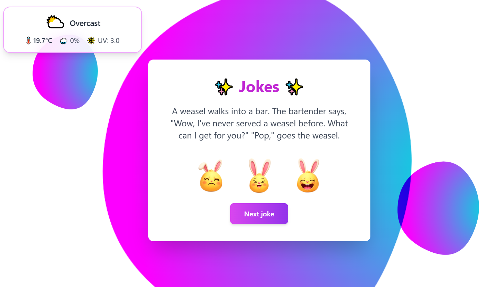

# ⚡️ SPRINT 4: TypeScript and APIS implementation

This sprint involves the creation of a application to master **API consumption**, and **TypeScript implementation**.

## 🎯 Objectives:

- **Consume Multiple APIs:** Implement logic to fetch jokes from two different APIs and display local weather data via a third API.
- **Strict TypeScript Implementation:** Ensure the entire application is built using **TypeScript**, defining clear interfaces and types for all data structures .
- **Asynchronous Handling:** Utilize **Promises** or **async/await** for all API consumption and data fetching operations.
- **User Tracking & State Management:** Maintain an internal array to track and store user-rated jokes.
- **Advanced UI/UX:** Develop a high-quality, responsive design.

## 💻 Technology Stack:

- **TypeScript**
- **Vite**
- **Tailwind CSS**
- **Vitest**
- **npm**

## 📋 Files:

```
├── sprint4-typescriptAPI/
│   ├── assets/
│   ├── dist/
│   ├── node_modules/
├── src/
│   ├── api/
│   │   └── apis.ts
│   ├── services/
│   │   ├── getJoke.ts
│   │   ├── getWeather.ts
│   │   ├── jokeState.ts
│   │   └── reportTracking.ts
│   ├── test/
│   │   ├── apis.test.ts
│   │   ├── jokeState.test.ts
│   │   ├── reportTracking.test.ts
│   │   └── setup.ts
│   ├── types/
│   │   └── interfaces.ts
│   ├── ui/
│   │   ├── jokeDom.ts
│   │   └── weatherDom.ts
│   ├── utils/
│   │   ├── getUserLocation.ts
│   │   └── weatherCode.ts
│   └── main.ts
├── styles/
│   └── tailwind.config.js
├── .gitignore
├── index.html
├── package-lock.json
├── package.json
├── README.md
├── tsconfig.json
└── vite-config.ts
```

## 🛠 Installation:

1.  **Clone the Repository:**

    ```bash
    git clone https://github.com/claudiabcn/sprint4-typescriptAPI
    ```

2.  **Install Dependencies:**

    ```bash
    cd sprint4-typescriptAPI
    npm install
    ```

3.  **Run the Tests:** `npm test`

## 📸 Demo:

[https://sprint4-typescript-api.vercel.app/](https://sprint4-typescript-api.vercel.app/)



## ⭐ Learnings and challenges:

This sprint provided significant professional growth. The complexity of TypeScript presented a demanding challenge; mastering its syntax and maintaining strict type safety across all interfaces and data flows required considerable effort. Furthermore, integrating multiple, varied APIs proved difficult, requiring meticulous data mapping and normalization to ensure consistent application state. A major professional gain was the discovery and adoption of Vite, whose efficiency and speed dramatically improved the development workflow and build experience. A notable structural challenge was determining the optimal separation of concerns and deciding how many distinct files and folders to create to isolate functionalities (e.g., separating API calls, state management, and DOM handling) efficiently. Overall, the sprint successfully refined my skills in robust asynchronous programming and structured application design.
